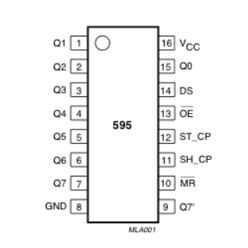
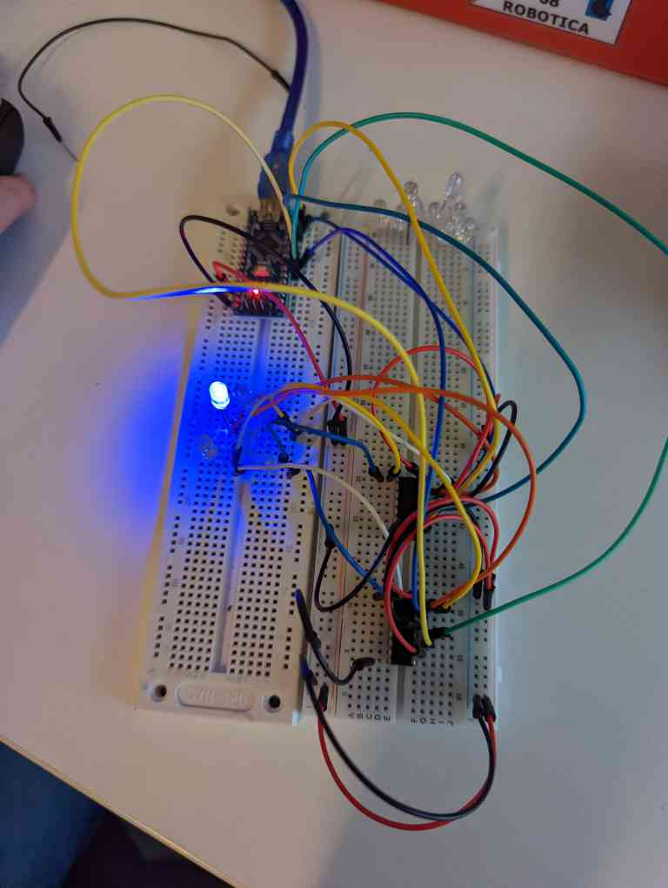
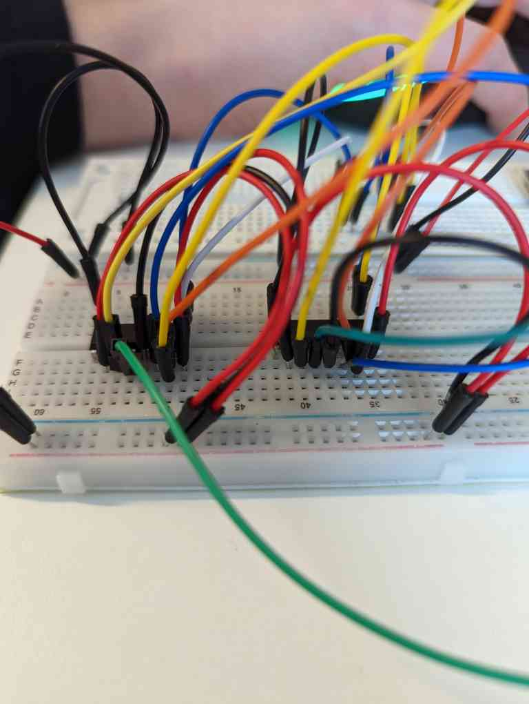

# wiring

### shift 1
1. latchPin -> arduino: 10, shift: 12
2. clockPin -> arduino: 12, shift: 11
3. dataPin -> arduino: 11, shift: 14
4. $V_{cc}$ -> arduino: 5V, shift: 16
5. $\overline{MR}$ -> arduino: 5V, shift: 10
6. GND -> arduino: GND, shift: 8
7. $\overline{OE}$ -> arduino: GND, shift: 13

### shift 1
1. latchPin -> arduino: 4, shift: 12
2. clockPin -> arduino: 6, shift: 11
3. dataPin -> arduino: 5, shift: 14
4. $V_{cc}$ -> arduino: 5V, shift: 16
5. $\overline{MR}$ -> arduino: 5V, shift: 10
6. GND -> arduino: GND, shift: 8
7. $\overline{OE}$ -> arduino: GND, shift: 13

